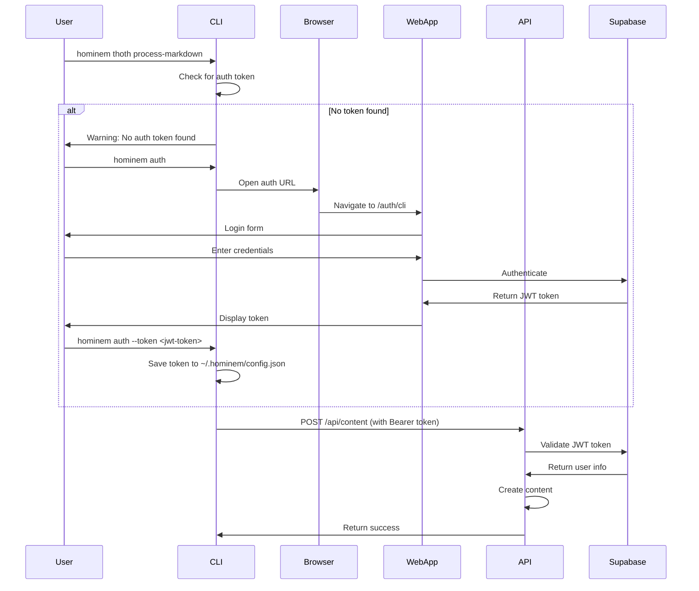

# CLI Authentication Guide

## Overview

The CLI authenticates with the hominem API using **Supabase JWT tokens**. The API uses Supabase for authentication and expects bearer tokens in the `Authorization` header.

## Authentication Flow



## Authentication Methods

### 1. Config File (Recommended)
The CLI stores authentication tokens in `~/.hominem/config.json`:

```json
{
  "token": "eyJhbGciOiJIUzI1NiIsInR5cCI6IkpXVCJ9...",
  "timestamp": "2024-01-01T00:00:00.000Z"
}
```

### 2. Environment Variable
Set the `AUTH_TOKEN` environment variable:

```bash
export AUTH_TOKEN="eyJhbGciOiJIUzI1NiIsInR5cCI6IkpXVCJ9..."
```

### 3. Runtime Parameter
Pass token directly to the API client:

```typescript
const apiClient = new ApiClient('http://localhost:3000', 'your-token-here')
```

## Getting Started

### Step 1: Authenticate
```bash
# Interactive authentication (opens browser)
hominem auth --open

# Or visit the URL manually
hominem auth
# Then visit: http://localhost:4444/auth/cli?from=cli

# Direct token input
hominem auth --token <your-supabase-jwt-token>
```

### Step 2: Use CLI Commands
```bash
# Now all API calls will be authenticated
hominem thoth group-markdown-by-heading ./my-notes
```

## Token Priority

The CLI checks for authentication tokens in this order:

1. **Constructor parameter** (when creating ApiClient directly)
2. **Environment variable** (`AUTH_TOKEN`)
3. **Config file** (`~/.hominem/config.json`)

## API Authentication

The API validates tokens using Supabase's `auth.getUser()` method:

```typescript
// API middleware validates the token
const { data: { user }, error } = await supabaseClient.auth.getUser(token)

if (error || !user) {
  return c.json({ error: 'Invalid token' }, 401)
}
```

## Token Requirements

- **Type**: Supabase JWT tokens
- **Format**: `Bearer <token>`
- **Scope**: User must exist in the hominem database
- **Expiration**: Tokens expire based on Supabase configuration

## Error Handling

### Common Authentication Errors

1. **No token found**:
   ```
   Warning: No authentication token found. Run `hominem auth` to authenticate.
   ```

2. **Invalid token**:
   ```
   API request failed: 401 Unauthorized - Invalid token
   ```

3. **Expired token**:
   ```
   API request failed: 401 Unauthorized - Token expired
   ```

### Solutions

- **No token**: Run `hominem auth` to authenticate
- **Invalid/expired token**: Re-authenticate with `hominem auth`
- **Network issues**: Check if the API is running and accessible

## Security Considerations

1. **Token Storage**: Tokens are stored in `~/.hominem/config.json` with restricted permissions
2. **Token Transmission**: Tokens are sent over HTTPS in production
3. **Token Expiration**: Tokens expire automatically based on Supabase settings
4. **Token Scope**: Tokens are scoped to individual users

## Development Setup

For development, ensure:

1. **API is running**: `cd apps/api && npm run dev`
2. **Supabase is configured**: Check environment variables in API
3. **Web app is running**: `cd apps/notes && npm run dev` (for authentication flow)

## Troubleshooting

### CLI can't find token
```bash
# Check if config file exists
ls -la ~/.hominem/config.json

# Check token format
cat ~/.hominem/config.json | jq .token
```

### API authentication fails
```bash
# Test token directly
curl -H "Authorization: Bearer $TOKEN" http://localhost:3000/api/content
```

### Re-authenticate
```bash
# Clear existing token and re-authenticate
rm ~/.hominem/config.json
hominem auth --open
``` 
