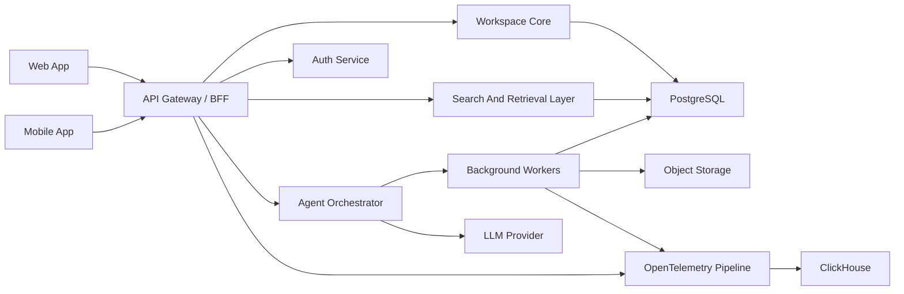

# Technical Architecture And Implementation

## Architecture Goal

The architecture shall optimize for low-latency capture, trustworthy persistence, scoped retrieval, and safe AI-assisted mutation.

The system shall start as a modular monolith with explicit internal boundaries. Services shall only split out when performance, scaling, or team topology makes extraction necessary.

## System Design

## Component Responsibilities

### Frontend

- The frontend shall provide feed, note, and chat surfaces optimized for recognition and continuity.
- Mobile shall optimize for capture and quick review.
- Web and desktop shall optimize for deep reading, editing, and synthesis.

### API Gateway / BFF

- The API layer shall enforce authentication and authorization.
- The API layer shall expose typed contracts to clients.
- The API layer shall aggregate feed and retrieval queries into client-ready shapes.

### Workspace Core

- The workspace core shall own notes, chats, feed ordering, tags, links, spaces, and tasks.
- The workspace core shall apply durable-write rules and maintain invariant checks.

### Search And Retrieval Layer

- The retrieval layer shall own full-text indexing, relevance ranking, and scoped context recall.
- The retrieval layer shall prioritize explicit user-attached context when available.

### Agent Orchestrator

- The agent layer shall coordinate model calls, tool execution, approval workflows, and provenance capture.
- The agent layer shall only perform durable mutations through explicit application services.

### Background Workers

- Background workers shall handle indexing, summarization, imports, sync reconciliation, and telemetry enrichment.
- Background work shall be asynchronous unless user-perceived correctness requires synchronous completion.

## Recommended Tech Stack

| Layer | Choice | Justification |
| --- | --- | --- |
| Web frontend | React 19 + TypeScript + TanStack Router | Strong fit for feed and chat workflows with modern rendering patterns |
| Mobile | React Native / Expo | Fast path to reliable native-feeling capture |
| Styling | Tailwind CSS + design tokens | Enforces a calm, consistent interface system |
| State management | TanStack Query + local component state | Reduces client complexity in a server-state heavy product |
| API | Hono + typed RPC layer | High-performance request handling with strong contract typing |
| Runtime | Bun | Fast startup and efficient TypeScript execution |
| Database | PostgreSQL | Strong relational integrity, indexing, full-text search, and durable product-state storage |
| Search | PostgreSQL FTS initially | Keeps the MVP operationally simple while supporting scoped retrieval |
| Auth | Better Auth or equivalent OIDC-capable auth layer | Supports email, OAuth, passkeys, device flow, and session control |
| Jobs | Postgres-backed queue initially | Minimizes infrastructure sprawl in 0-to-1 |
| Storage | S3-compatible object storage | Durable storage for attachments and exported artifacts |
| Infrastructure | Fly.io or AWS ECS/Fargate with managed Postgres | Low-ops launch path with clear scaling runway |
| Observability | OpenTelemetry + ClickHouse | Required for latency tracking, event forensics, audit streams, and debugging |

## Data Flow

### Capture Flow

1. The client submits a note or chat payload.
2. The API authenticates the actor and validates input.
3. The workspace core writes the durable record and updates feed ordering fields.
4. The API returns the canonical object shape.
5. Background workers update search indexes and emit observability events.

### Grounded Chat Flow

1. The user opens or starts a chat.
2. The client sends the message plus any explicit attachments.
3. The API resolves visibility and retrieves relevant notes, chats, and links.
4. The agent orchestrator builds a bounded context window.
5. The model returns a response and any proposed structured mutations.
6. The system stores the response as chat history.
7. Consequential mutations require explicit approval before durable write.

### Promotion Flow

1. The user accepts a suggested action.
2. The API validates the target operation.
3. The workspace core writes the resulting note update, task, or link.
4. The system records durable provenance in product state and emits audit events to the observability pipeline.

## Public Interfaces

The architecture shall expose typed client contracts for:

- feed queries
- note CRUD and version history
- chat session and message operations
- search and retrieval queries
- task creation and update
- space membership and visibility operations
- approval and mutation review flows

Structured AI write actions shall use typed envelopes:

$$
MutationEnvelope = \{ action, target, payload, provenance, requiresApproval \}
$$

## State And Event Boundaries

The system shall distinguish canonical product state from operational event streams.

PostgreSQL shall store:

- users, sessions, notes, chats, spaces, tags, goals, tasks, and other durable product objects
- immutable history required for product trust, such as note versions and chat history
- minimal trust-critical facts that are part of application state

ClickHouse shall store:

- request logs
- traces and performance signals
- search exhaust
- audit event streams
- agent/tool execution events

Rule of thumb:

- if the application must treat the record as durable truth, store it in PostgreSQL
- if the system needs the record for observability, forensics, or large-scale event analysis, emit it to ClickHouse

## Security

- The identity layer shall support OIDC-compatible federation, passkeys, session revocation, and step-up auth.
- JWT access tokens shall be short-lived.
- Refresh tokens, session tokens, API keys, and verification tokens shall be hashed or encrypted at rest.
- Authorization shall be enforced through ownership, direct sharing, and space membership boundaries.
- Tags and links shall never act as access-control primitives.
- Critical identity, sharing, and AI-mutation events shall be emitted to the audit event stream.

## Scalability

- The feed shall use cursor pagination on ordered activity fields.
- Heavy retrieval, indexing, and import work shall run asynchronously.
- Search shall remain user- and space-scoped before ranking to reduce candidate sets.
- Read models may be introduced only when direct relational queries fail latency targets.

The primary synchronous latency budget shall be:

$$
Latency_{total} = Latency_{auth} + Latency_{query} + Latency_{retrieval} + Latency_{llm} + Latency_{render}
$$

Launch targets:

- $P95_{non\text{-}LLM} < 300\,ms$
- $P95_{capture} < 200\,ms$
- $P95_{feed} < 250\,ms$

## Failure Modes And Handling

- If retrieval fails, the system shall fall back to explicit attachments and recent local context.
- If indexing is delayed, newly-created objects shall remain immediately visible in direct views and the feed.
- If AI mutation validation fails, the system shall preserve the chat response but reject the durable write.
- If imports fail, the system shall preserve source status and retry metadata without blocking core workspace flows.
