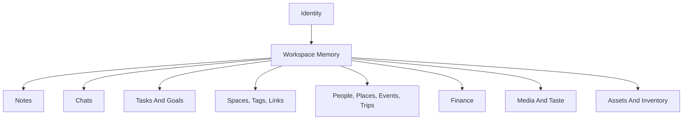

# Schema Overview

## Purpose

This is the canonical product requirements entry point for the Cortex data model.

The schema docs should describe human-facing domains first and implementation objects second. Table names matter, but they are not the product language.

It defines:

- the permanent design principles for the schema
- the core primitives the platform is built on
- the domain classes of tables the team maintains
- the authoritative PRD documents for each class

This document should be the first stop before adding, removing, renaming, or restructuring tables.

## Core Promise

The database must support a system where users can manage life through one intelligent interface without losing:

- structure
- history
- context
- collaboration
- provenance
- portability

## Design Principles

1. The schema must model the user’s life, not a bundle of separate apps.
2. The schema must preserve durable facts and histories, not just current snapshots.
3. The schema must distinguish semantics, containment, access, provenance, and behavior.
4. The schema must favor strong constraints over convention.
5. The schema must support both personal use and multi-user collaboration.
6. The schema must let AI act on durable structured data instead of raw chat logs alone.
7. The schema must support high-performance query patterns for search, grouping, timeline reconstruction, and graph traversal.
8. The schema must treat personalization as product data when it helps recognition and recall.

## Canonical Primitives

### Entities

First-class objects with durable identity.

### Events

Time-based facts that should be preserved as history.

### Spaces

Collaborative context boundaries.

### Tags

Cross-domain semantic grouping.

### Links

Explicit semantic relationships between entities.

### Provenance

Imported data, sync state, source mappings, and user-edited-versus-imported distinctions.

## Domain Classes

1. [Auth And Identity](./auth-identity.md)
2. [Memory And Conversation](./memory-conversation.md)
3. [Collaboration And Semantics](./collaboration-semantics.md)
4. [People, Places, Time, And Journeys](./people-places-time-journeys.md)
5. [Goals And Commitments](./goals-commitments.md)
6. [Finance](./finance.md)
7. [Media And Taste](./media-taste.md)
8. [Assets And Inventory](./assets-inventory.md)

## Cross-Cutting Requirements

Every domain class must state:

- what user outcomes it enables
- which tables belong to it
- which fields are behavior-driving and must remain explicit
- which relationships are strict
- which histories must be preserved
- how access works
- what queries must remain fast
- what imported provenance must be preserved
- what is intentionally out of scope

Observability, analytics exhaust, and audit event streams are not schema domains in this model. Those concerns belong to the operational architecture and observability stack unless a specific record is part of durable product state.

## Performance Requirements

The schema must optimize for:

- low-friction inserts
- predictable point lookups
- fast cross-entity semantic grouping through tags
- explicit collaboration queries through spaces
- event history queries by time range
- fuzzy lookup where humans search by imperfect names
- hierarchical grouping when tag families are used
- derived read models only where they materially improve performance

## What This Bible Replaces

This PRD set supersedes using exploratory review docs as the main source of truth.

Exploration docs still matter, but they now serve as supporting rationale rather than canonical requirements.

---

# Data Model Overview

## Strategic Framing

The product narrative is narrower than the total schema surface.

The shipped product is a notes-first personal workspace. The broader model exists because durable personal context compounds across domains. The architecture shall therefore distinguish:

- launch-critical product surfaces
- adjacent context domains that strengthen retrieval and reasoning
- long-range optional domains that should remain model-compatible without dominating the core story

## Canonical Model

The system is built on six primitives:

1. **Entities**: durable things the system can reference, relate, contain, tag, and retrieve
2. **Events**: time-based facts that preserve history rather than overwrite it
3. **Spaces**: collaboration and visibility boundaries
4. **Tags**: cross-domain semantic groupings
5. **Links**: explicit relationships between entities
6. **Provenance**: source, sync, import, and mutation lineage

## Conceptual Domain Map

## Model Priorities

### Launch-Critical

These domains define the initial product moat:

- identity
- workspace memory
- collaboration and semantics
- goals and commitments

### Retrieval-Amplifying

These domains strengthen the quality of recall and reasoning:

- people, places, time, and journeys
- finance

### Long-Range Compounding

These domains deepen personal context over time but should not dominate launch messaging:

- media and taste
- assets and inventory

## Operational Boundary

Observability, telemetry, and audit event streams are not first-class schema domains in the Cortex product model.

The product database shall store durable product state and only the minimum trust-critical records that are part of that state. High-volume logs, search exhaust, request traces, and investigative audit streams shall live in the observability stack.

In practice:

- PostgreSQL stores canonical product truth
- ClickHouse stores append-heavy observability and audit event streams

This distinction keeps the schema focused on user and product state rather than infrastructure exhaust.

## Core Invariants

The model shall preserve the following truths:

1. Notes and chats are durable first-class objects.
2. Historical state is preserved where trust depends on it.
3. Visibility is governed by ownership and spaces, not by semantic labels.
4. Cross-domain reasoning depends on explicit entity identity.
5. Imported facts must retain provenance.
6. Ordered collections shall be modeled explicitly where order matters.
7. Queryability is a product feature, not an implementation afterthought.

## Query Shapes That Matter

The business depends on the following query families performing well:

### 1. Personal Feed Reconstruction

The system shall reconstruct a user's active workspace timeline across notes and chats with strong recency semantics.

### 2. Context Retrieval For Grounded Reasoning

The system shall retrieve the most relevant workspace objects for a user query, subject to visibility boundaries and boosted by explicit links, recency, and attachment signals.

### 3. Space-Scoped Collaboration Views

The system shall support fast answers to questions like "what is in this shared context" and "what changed here recently."

### 4. Cross-Entity Semantic Lookup

The system shall support tag-based, link-based, and relationship-based retrieval across domains.

### 5. Time-Window Recall

The system shall support queries that reconstruct what happened around a date, meeting, trip, or decision window.

### 6. History And Provenance Inspection

The system shall support trustworthy answers to questions like "what changed," "who changed it," and "where did this come from."

## Modeling Discipline

The schema strategy shall favor durable conceptual leverage over local feature convenience.

That means:

- do not let UI navigation define the data model
- do not let imports dictate first-class product abstractions
- do not collapse collaboration, semantics, and provenance into one structure
- do not optimize early for edge workflows that weaken the core workspace thesis
