```mermaid
flowchart TB
  %%=========================
  %% Hominem — dope visual map
  %%=========================

  subgraph root["hominem (monorepo)"]
    direction TB
    A_apps(["📦\napps/"])
    B_packages(["🧩\npackages/"])
    C_services(["⚙️\nservices/"])
    D_config(["🛠️\nconfig/"])
    E_docs(["📚\ndocs/"])
    F_scripts(["🧰\nscripts/"])
    G_rootFiles(["🗂️\nroot files"])
  end

  subgraph apps["apps/"]
    direction LR
    app_api(["🌐\napi"])
    app_finance(["💸\nfinance"])
    app_notes(["📝\nnotes"])
    app_rocco(["🎛️\nrocco"])
    app_workers(["🧑‍🏭\nworkers"])
  end

  subgraph packages["packages/"]
    direction LR
    p_ai(["🤖\nai"])
    p_auth(["🔐\nauth"])
    p_career(["🏷️\ncareer"])
    p_chat(["💬\nchat"])
    p_db(["🗄️\ndb"])
    p_events(["🎫\nevents"])
    p_finance_pkg(["💼\nfinance"])
    p_health(["🩺\nhealth"])
    p_hono_client(["📡\nhono-client"])
    p_hono_rpc(["🛰️\nhono-rpc"])
    p_invites(["✉️\ninvites"])
    p_jobs(["🧾\njobs"])
    p_lists(["📋\nlists"])
    p_notes(["🗂️\nnotes"])
    p_places(["📍\nplaces"])
    p_services_pkg(["🔌\nservices"])
    p_ui(["✨\nui"])
    p_utils(["🔧\nutils"])
    p_prisma(["🌱\nprisma"])
    p_tools(["🧰\ntools/cli"])

    %% Representative package internals (expand for clarity)
    subgraph db_pkg["db — package"]
      direction TB
      db_pkg_json(["package.json"]):::misc
      db_src(["src/"]):::misc
      db_build(["build/"]):::misc
    end

    subgraph hono_rpc_pkg["hono-rpc — package"]
      direction TB
      rpc_pkg_json(["package.json"]):::misc
      rpc_src(["src/"]):::misc
    end

    subgraph ui_pkg["ui — package"]
      direction TB
      ui_pkg_json(["package.json"]):::misc
      ui_src(["src/"]):::misc
      ui_storybook(["stories/"]):::misc
    end

    subgraph utils_pkg["utils — package"]
      direction TB
      utils_pkg_json(["package.json"]):::misc
      utils_src(["src/"]):::misc
    end
  end

  subgraph services["services/"]
    direction LR
    s_api(["🚀\napi (service)"])
    s_workers(["🔁\nworkers (service)"])
  end

  %% Top-level connections
  root --> A_apps
  root --> B_packages
  root --> C_services
  root --> D_config
  root --> E_docs
  root --> F_scripts
  root --> G_rootFiles

  %% Representative app -> package edges
  app_api --> p_hono_client
  app_api --> p_hono_rpc
  app_finance --> p_db
  app_finance --> p_utils
  app_notes --> p_notes["🗂️\nnotes (pkg)"]

  %% Services -> packages
  s_api --> p_db
  s_api --> p_hono_rpc
  s_workers --> p_jobs["🧾\njobs (pkg)"]

  %% Visual styling (dope palette)
  classDef top fill:#0f172a,stroke:#7c3aed,color:#fff,stroke-width:1.5;
  classDef apps fill:#0ea5a4,stroke:#065f46,color:#051622,stroke-width:1.2;
  classDef pkgs fill:#f97316,stroke:#7c2d12,color:#111827,stroke-width:1.2;
  classDef svcs fill:#06b6d4,stroke:#0e7490,color:#022b35,stroke-width:1.2;
  classDef misc fill:#efefef,stroke:#111827,color:#111827,stroke-width:1;

  class A_apps,B_packages,C_services top;
  class app_api,app_finance,app_notes,app_rocco,app_workers apps;
  class p_ai,p_auth,p_career,p_chat,p_db,p_events,p_finance_pkg,p_health,p_hono_client,p_hono_rpc,p_invites,p_jobs,p_lists,p_notes,p_places,p_services_pkg,p_ui,p_utils,p_prisma,p_tools pkgs;
  class s_api,s_workers svcs;
  class D_config,E_docs,F_scripts,G_rootFiles misc;

  %% make arrows tidy (straight, predictable)
  %% (removed curved interpolation and stray layout links)

  %% Legend
  subgraph Legend["Legend & Notes"]
    direction TB
    L1(["• Emojis indicate role/type — visual shortcuts"]):::misc
    L2(["• Colors group Apps / Packages / Services"]):::misc
    L3(["• Expand nodes or add edges if you want dependency-granularity"]):::misc
  end

  %% layout hints removed — nodes positioned by subgraph directions
``` 

# Hominem Monorepo Structure 🗂️

This file contains a Mermaid diagram that maps the top-level structure of the Hominem monorepo. Render it in a Markdown preview (VS Code, GitHub, or other Mermaid-capable viewer).

---

---

Highlights:
- **Where to edit**: add more nodes / arrows if you want more detail (e.g., individual packages inside `apps/*`).
- **How to view**: open `docs/monorepo-structure.md` in VS Code and use Markdown preview (or GitHub render) to see the Mermaid diagram.

If you'd like, I can add extra detail (package owners, dependency edges, or sub-folders) — tell me what level of detail you want next. ✅
